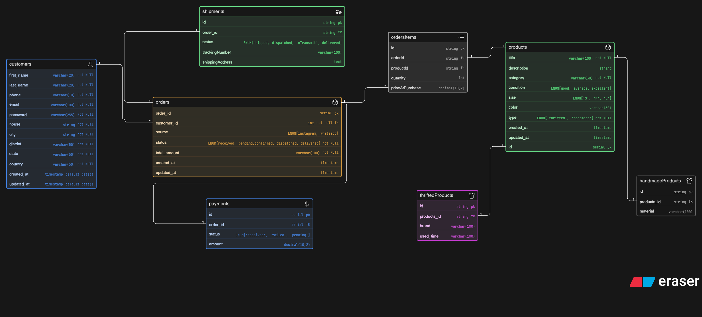
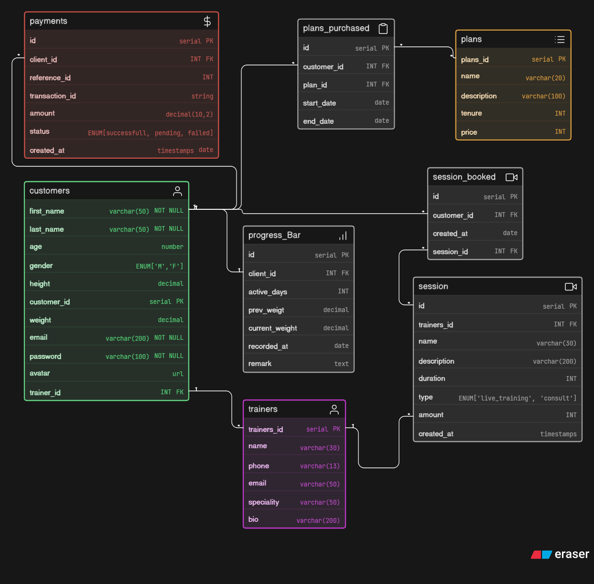
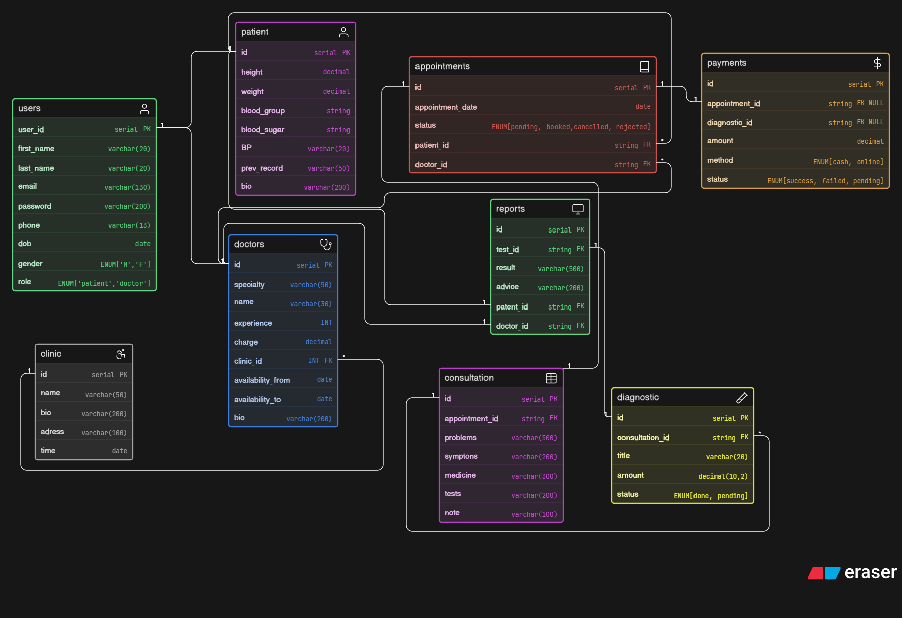

# DATABASE - DESIGN

## [Assignment 1. Instagram Thrift Creator Store](./assets/thrift-creator-dbDesign.png)

  <a href="https://github.com/DevRahulll/Chai-aur-Cohort-2026/tree/main/assignments/04_DB-Design">
      

      
    

  </a>

 

## [Assignment 2. Instagram Thrift Creator Store](./assets/Fitness-Influencer-Coaching-platform.png)

  <a href="https://github.com/DevRahulll/Chai-aur-Cohort-2026/tree/main/assignments/04_DB-Design">
      

      
    

  </a>

 

## [Assignment 3. Clinic Appointment and Diagnostic Platform](./assets/Clinic-appointment-and-diagnostic-platform.png)

  <a href="https://github.com/DevRahulll/Chai-aur-Cohort-2026/tree/main/assignments/04_DB-Design">
      

      
    

  </a>

 
