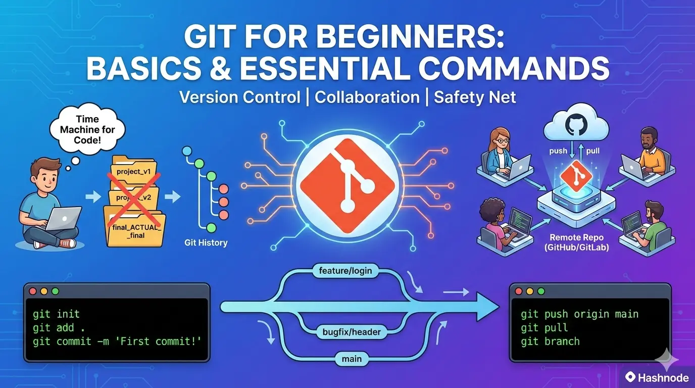
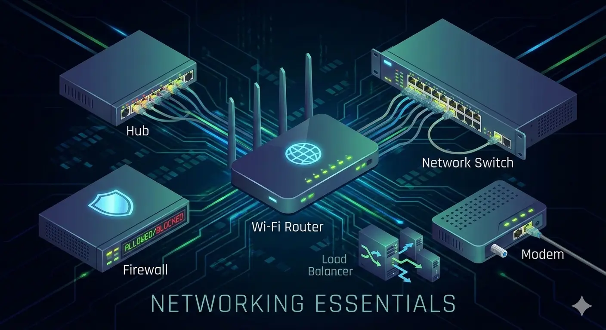
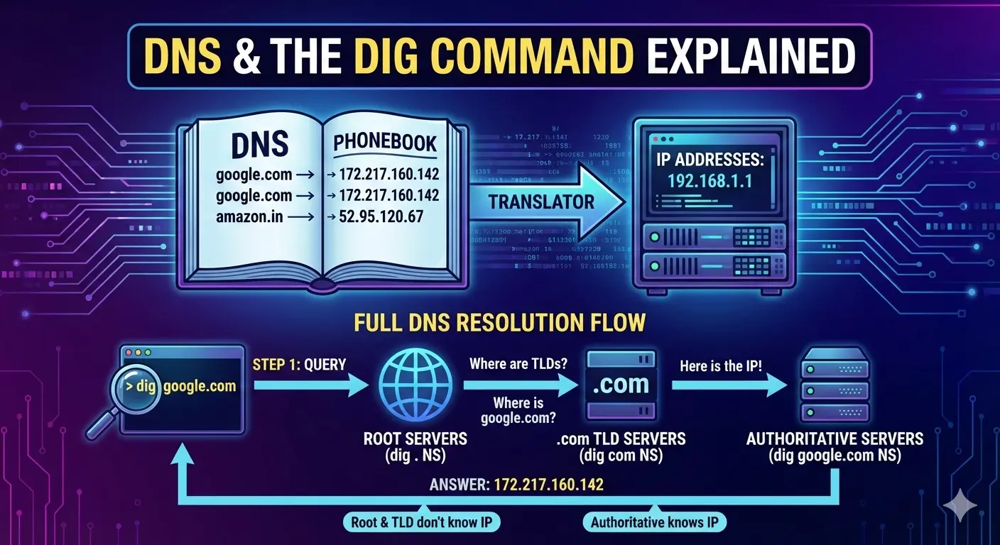
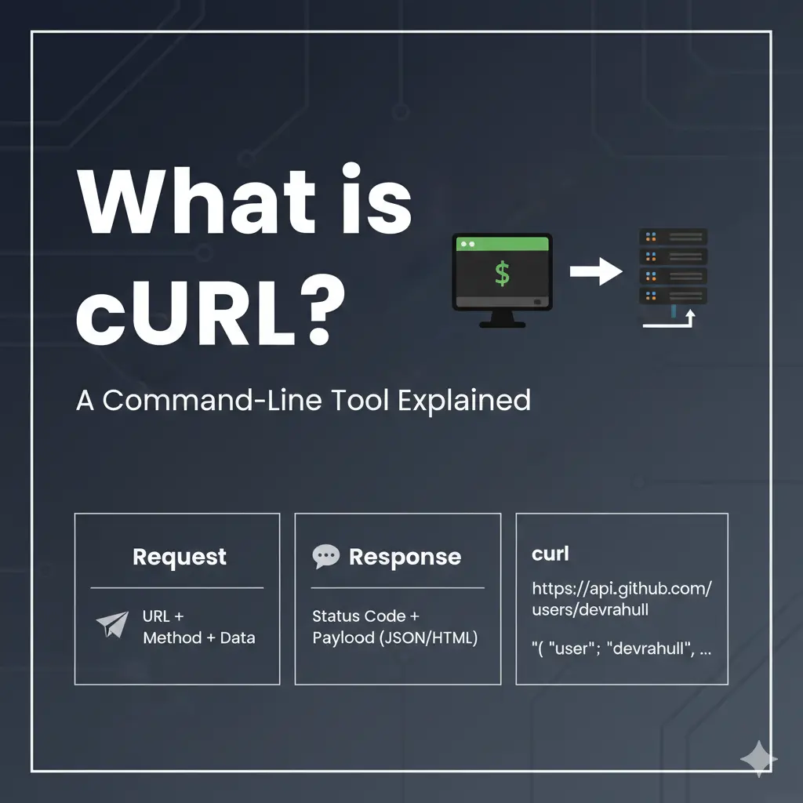
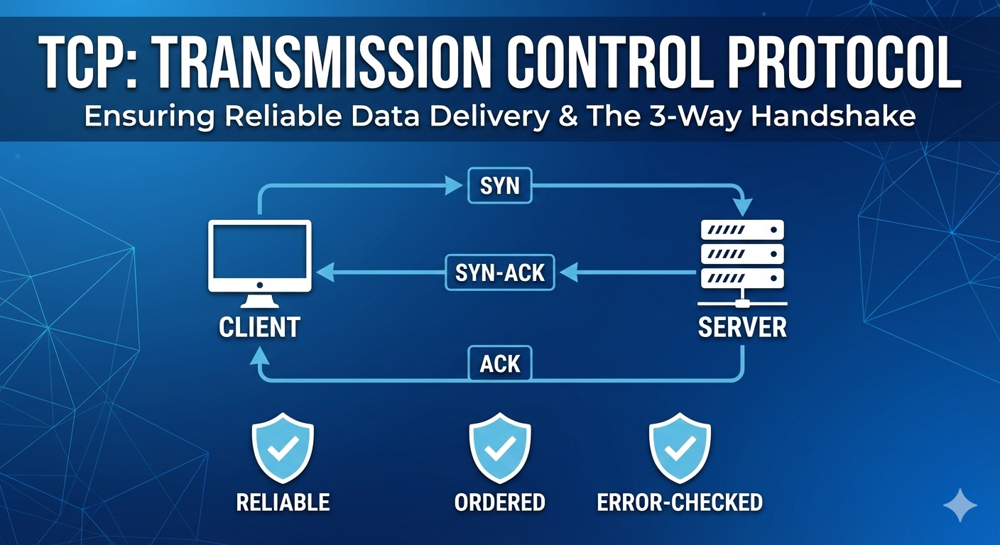
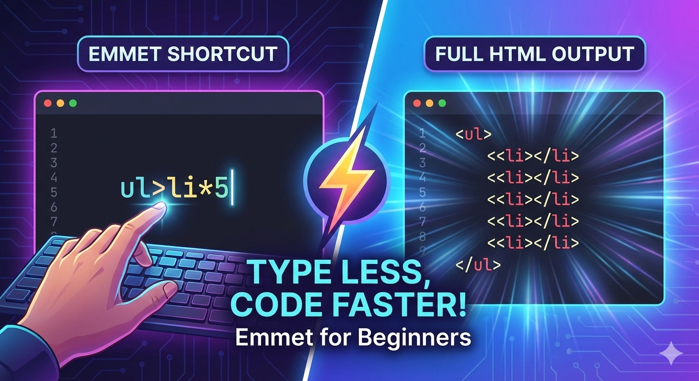
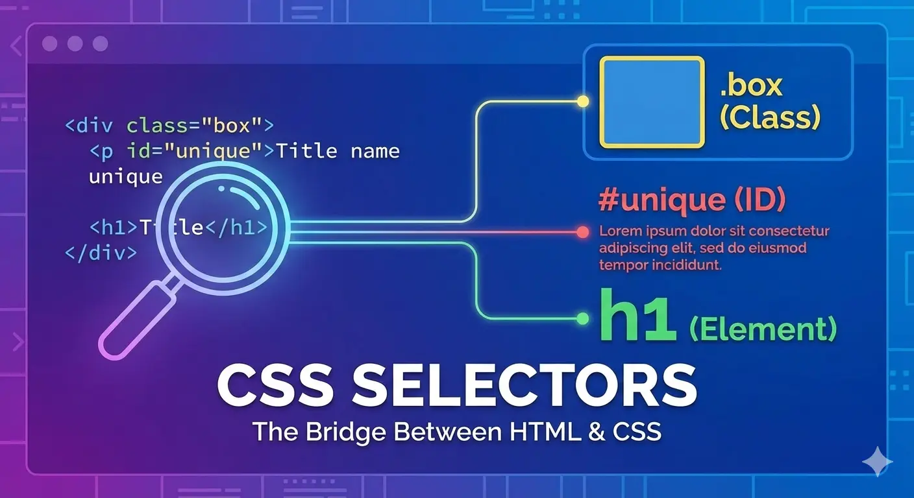

<a href="https://devrahulll.hashnode.dev/">
  <h1 align="center">Blogs Archive 📔</h1>
</a>

  Showcase of my journey to building a solid Foundation.

 

### 1. [Why Version Control Exists](https://devrahulll.hashnode.dev/git1)

  <!-- <a href="https://devrahulll.hashnode.dev/git1">
      

      
    

  </a> -->
 

### 2. [Git for Beginners](https://devrahulll.hashnode.dev/git2)

  <a href="https://devrahulll.hashnode.dev/git2">
      

      
    

  </a>

 

### 3. [Inside Git: How it works](https://devrahulll.hashnode.dev/git3)

  <a href="https://devrahulll.hashnode.dev/git3">
      

      
    

  </a>

 

### 4. [Understanding Network Devices](https://devrahulll.hashnode.dev/understanding-network-devices)

  <a href="https://devrahulll.hashnode.dev/understanding-network-devices">
      

      
    

  </a>

 

### 5. [How DNS Resolution Works](https://devrahulll.hashnode.dev/how-dns-resolution-works)

  <a href="https://devrahulll.hashnode.dev/how-dns-resolution-works">
      

      
    

  </a>

 

### 6. [DNS Record Types Explained](https://devrahulll.hashnode.dev/dns-record-types)

  <a href="https://devrahulll.hashnode.dev/dns-record-types">
      

      
    

  </a>

 

### 7. [Getting Started with cURL](https://devrahulll.hashnode.dev/curl)

  <a href="https://devrahulll.hashnode.dev/curl">
      

      
    

  </a>

 

### 8. [TCP Working: 3-way Handshake](https://devrahulll.hashnode.dev/tcp-working-3-way-handshake)

  <a href="https://devrahulll.hashnode.dev/tcp-working-3-way-handshake">
      

      
    

  </a>

 

### 9. [TCP vs UDP](https://devrahulll.hashnode.dev/tcp-vs-udp)

  <a href="https://devrahulll.hashnode.dev/tcp-vs-udp">
      

      
    

  </a>

 

### 10. [Understanding HTML Tags and Elements](https://devrahulll.hashnode.dev/html-tags-and-elements)

  <a href="https://devrahulll.hashnode.dev/html-tags-and-elements">
      

      
    

  </a>

 

### 11. [Emmet for HTML](https://devrahulll.hashnode.dev/emmet)

  <a href="https://devrahulll.hashnode.dev/emmet">
      

      
    

  </a>

 

### 12. [CSS Selectors](https://devrahulll.hashnode.dev/css-selectors)

  <a href="https://devrahulll.hashnode.dev/css-selectors">
      

      
    

  </a>

 
