<a href="https://devrahulll.hashnode.dev/">
  <h1 align="center">Blogs Archive 📔</h1>
</a>

  Showcase of my journey to building a solid Foundation.

 

### 1. [Why Version Control Exists](https://devrahulll.hashnode.dev/git1)

  <!-- <a href="https://devrahulll.hashnode.dev/git1">
      

      
    

  </a> -->
 

### 2. [Git for Beginners](https://devrahulll.hashnode.dev/git2)

  <a href="https://devrahulll.hashnode.dev/git2">
      

      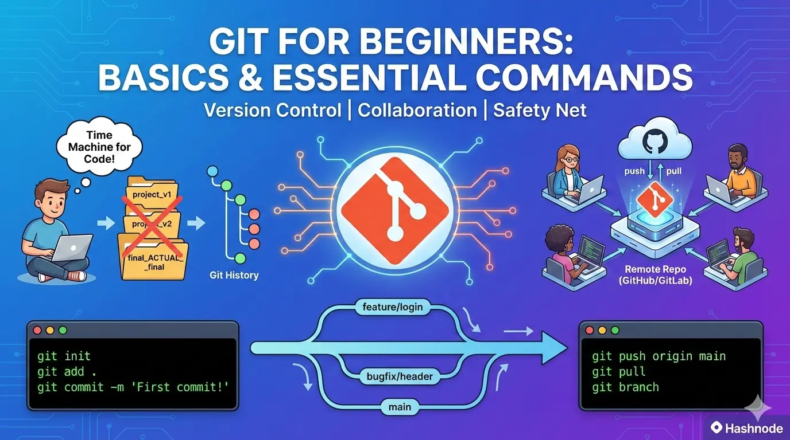
    

  </a>

 

### 3. [Inside Git: How it works](https://devrahulll.hashnode.dev/git3)

  <a href="https://devrahulll.hashnode.dev/git3">
      

      
    

  </a>

 

### 4. [Understanding Network Devices](https://devrahulll.hashnode.dev/understanding-network-devices)

  <a href="https://devrahulll.hashnode.dev/understanding-network-devices">
      

      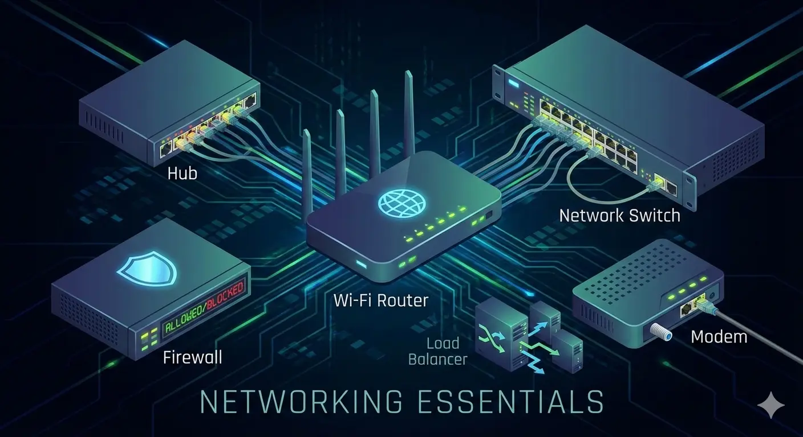
    

  </a>

 

### 5. [How DNS Resolution Works](https://devrahulll.hashnode.dev/how-dns-resolution-works)

  <a href="https://devrahulll.hashnode.dev/how-dns-resolution-works">
      

      
    

  </a>

 

### 6. [DNS Record Types Explained](https://devrahulll.hashnode.dev/dns-record-types)

  <a href="https://devrahulll.hashnode.dev/dns-record-types">
      

      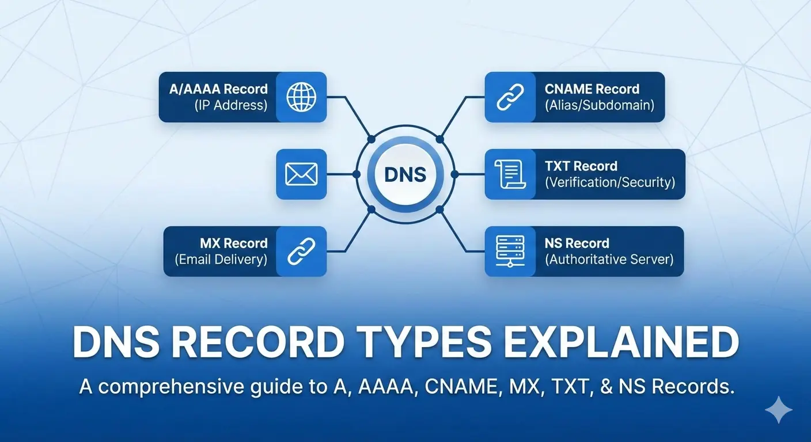
    

  </a>

 

### 7. [Getting Started with cURL](https://devrahulll.hashnode.dev/curl)

  <a href="https://devrahulll.hashnode.dev/curl">
      

      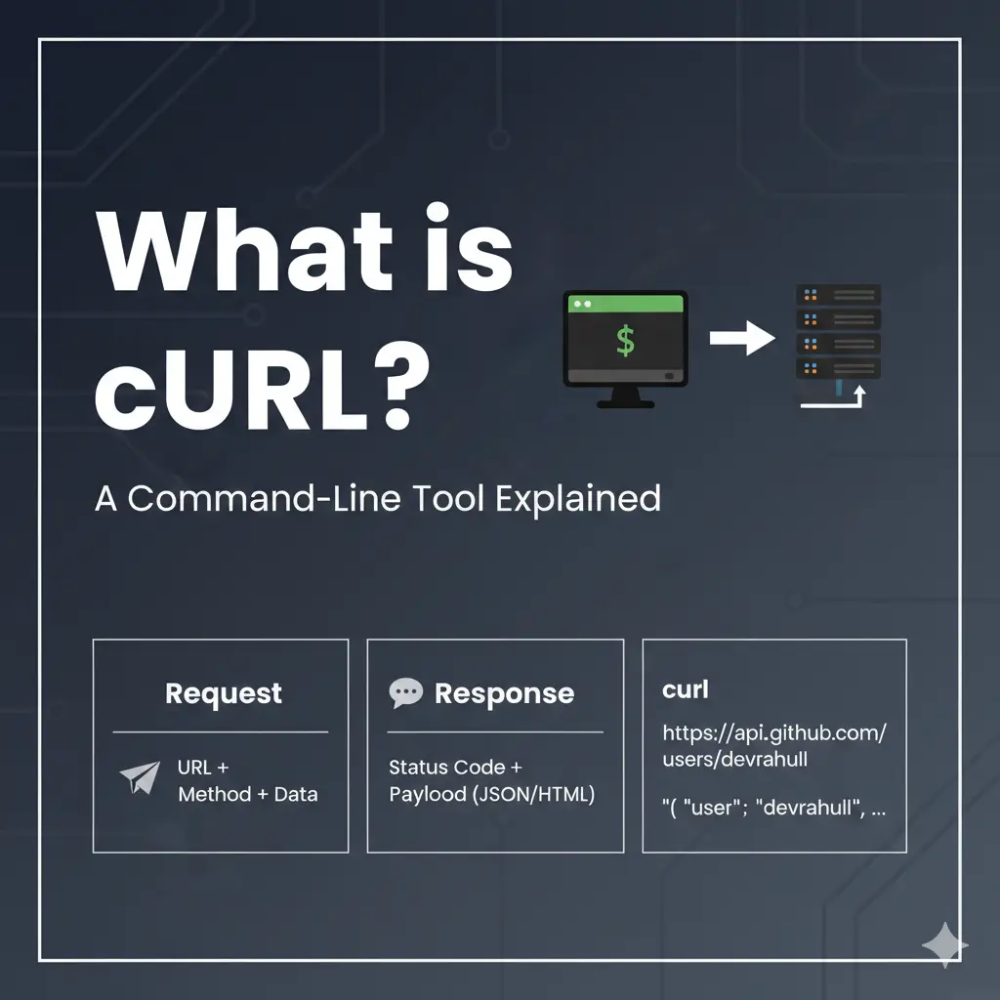
    

  </a>

 

### 8. [TCP Working: 3-way Handshake](https://devrahulll.hashnode.dev/tcp-working-3-way-handshake)

  <a href="https://devrahulll.hashnode.dev/tcp-working-3-way-handshake">
      

      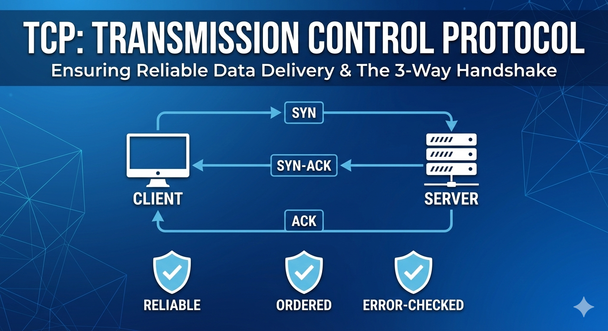
    

  </a>

 

### 9. [TCP vs UDP](https://devrahulll.hashnode.dev/tcp-vs-udp)

  <a href="https://devrahulll.hashnode.dev/tcp-vs-udp">
      

      
    

  </a>

 

### 10. [How a Browser Works](https://devrahulll.hashnode.dev/how-browsers-works)

  <a href="https://devrahulll.hashnode.dev/how-browsers-works">
      

      
    

  </a>

 

### 11. [Understanding HTML Tags and Elements](https://devrahulll.hashnode.dev/html-tags-and-elements)

  <a href="https://devrahulll.hashnode.dev/html-tags-and-elements">
      

      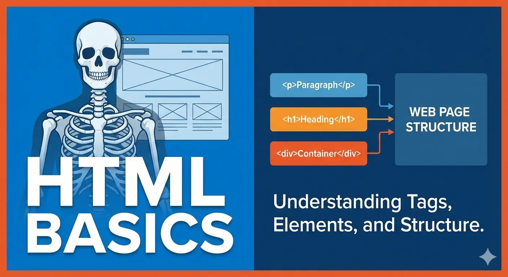
    

  </a>

 

### 12. [Emmet for HTML](https://devrahulll.hashnode.dev/emmet)

  <a href="https://devrahulll.hashnode.dev/emmet">
      

      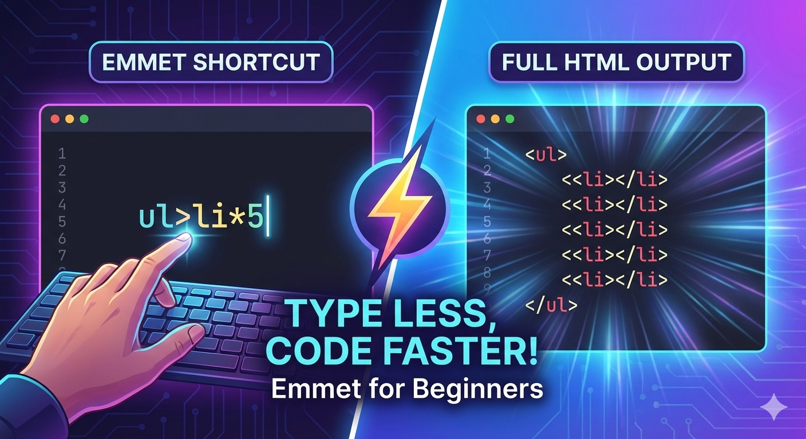
    

  </a>

 

### 13. [CSS Selectors](https://devrahulll.hashnode.dev/css-selectors)

  <a href="https://devrahulll.hashnode.dev/css-selectors">
      

      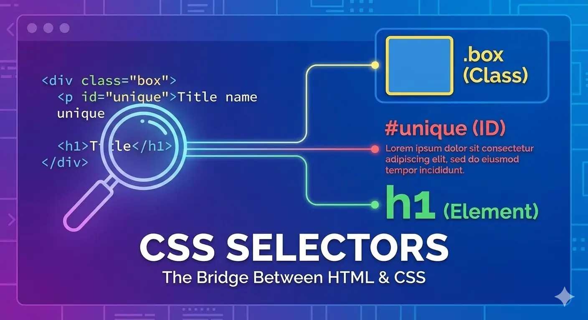
    

  </a>

 

### 14. [JavaScript Operators](https://devrahulll.hashnode.dev/javascript-operators)

  <a href="https://devrahulll.hashnode.dev/javascript-operators">
      

      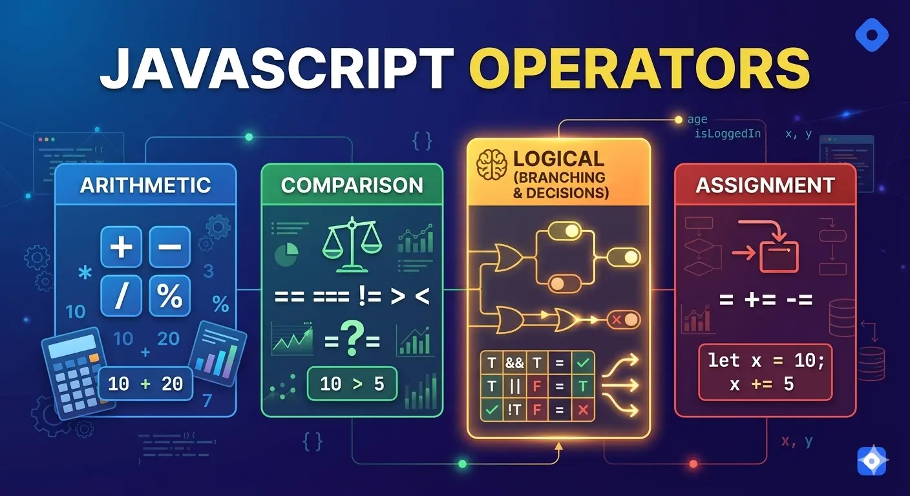
    

  </a>

 

### 15. [Understanding Variables & Data Types](https://devrahulll.hashnode.dev/variables-and-datatypes)

  <a href="https://devrahulll.hashnode.dev/variables-and-datatypes">
      

      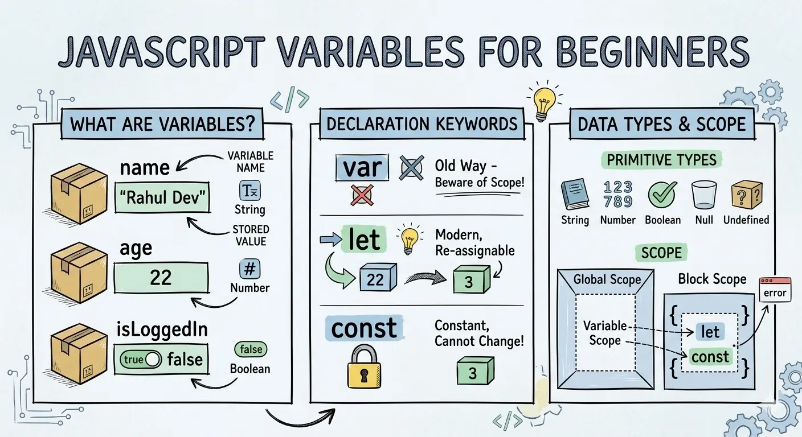
    

  </a>

 

### 16. [Control Flow in JavaScript](https://devrahulll.hashnode.dev/control-flow-in-javascript)

  <a href="https://devrahulll.hashnode.dev/control-flow-in-javascript">
      

      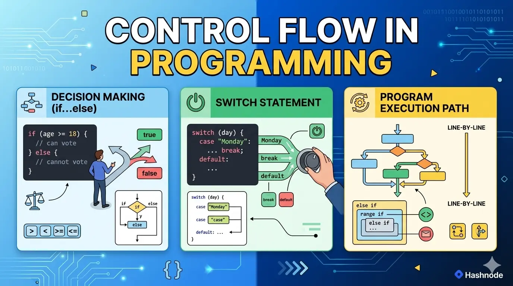
    

  </a>

 

### 17. [JavaScript Array](https://devrahulll.hashnode.dev/javascript-arrays-101)

  <a href="https://devrahulll.hashnode.dev/javascript-arrays-101">
      

      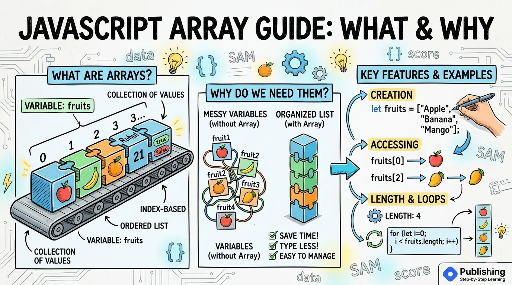
    

  </a>

 

### 18. [Understanding Objects](https://devrahulll.hashnode.dev/javascript-object)

  <a href="https://devrahulll.hashnode.dev/javascript-object">
      

      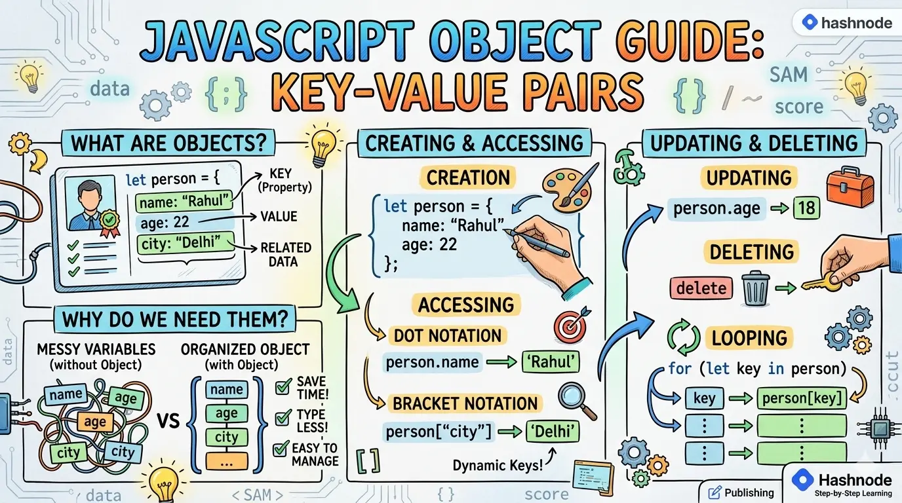
    

  </a>

 

### 19. [Function Declaration vs Function Expression](https://devrahulll.hashnode.dev/functions)

  <a href="https://devrahulll.hashnode.dev/functions">
      

      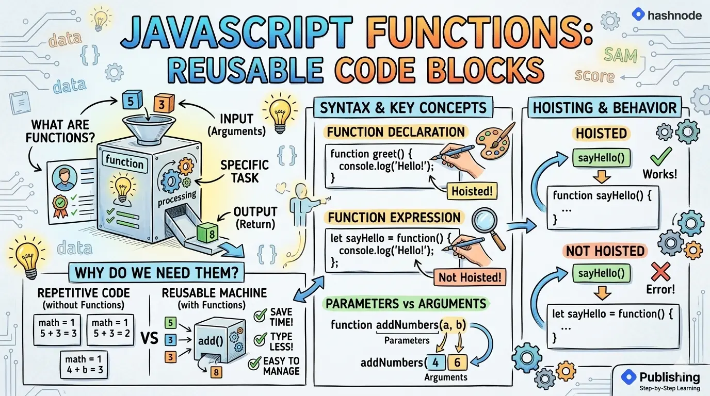
    

  </a>

 

### 20. [Arrow Function in JavaScript](https://devrahulll.hashnode.dev/arrow-functions)

  <a href="https://devrahulll.hashnode.dev/arrow-functions">
      

      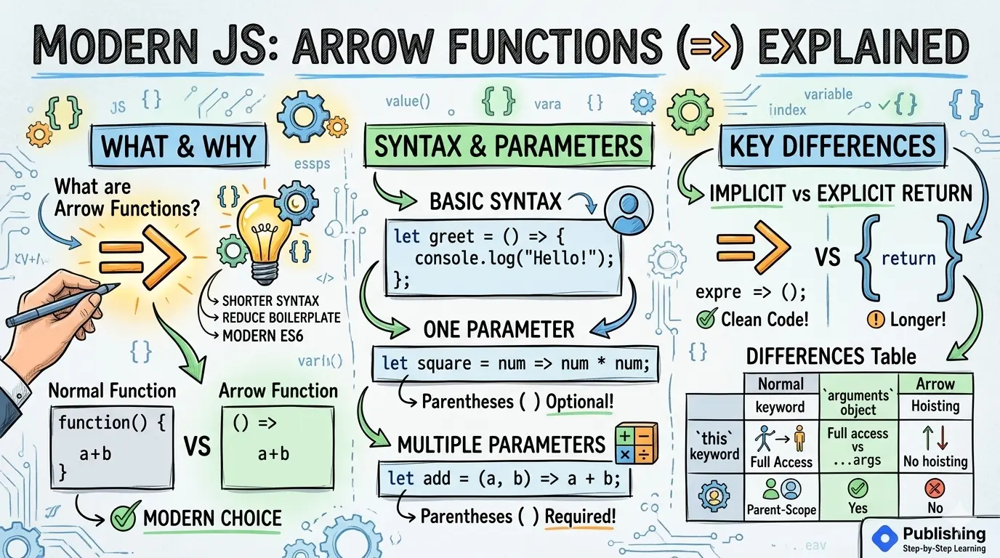
    

  </a>

 

### 21. [Array Methods You Must Know](https://devrahulll.hashnode.dev/array-methods)

  <a href="https://devrahulll.hashnode.dev/array-methods">
      

      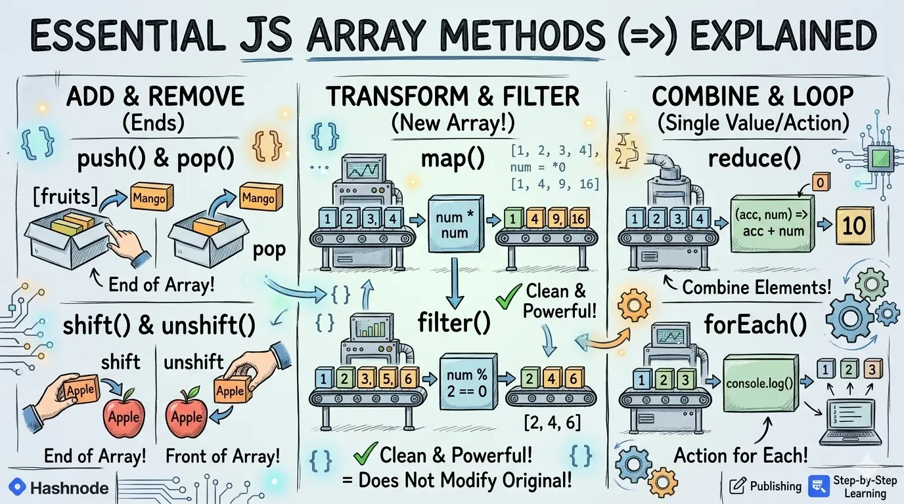
    

  </a>

 

### 22. [The Magic of this, call(), apply() and bind() in JavaScript](https://devrahulll.hashnode.dev/this-call-apply-and-bind-in-javascript)

  <a href="https://devrahulll.hashnode.dev/this-call-apply-and-bind-in-javascript">
      

      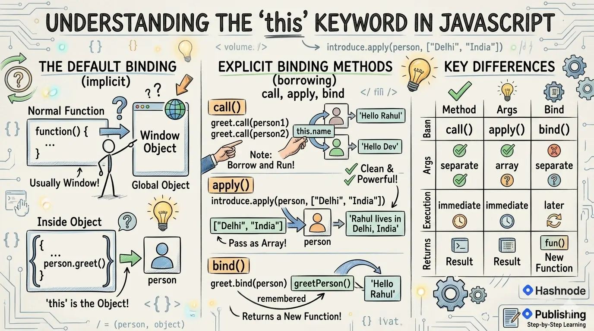
    

  </a>

 

### 23. [Understanding Object-Oriented Programming in JavaScript](https://devrahulll.hashnode.dev/object-oriented-programming-in-javascript)

  <a href="https://devrahulll.hashnode.dev/object-oriented-programming-in-javascript">
      

      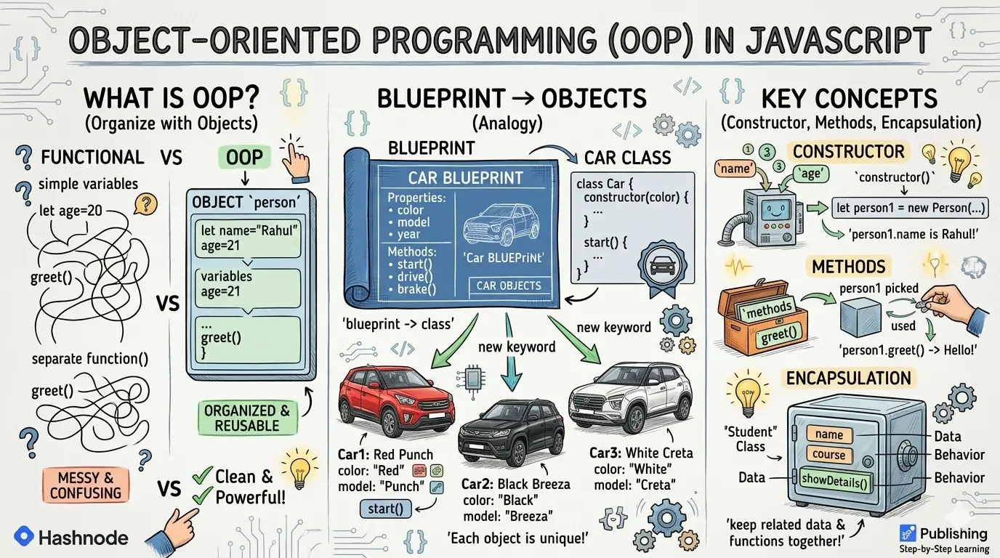
    

  </a>

 

### 24. [Template Literals in JavaScript](https://devrahulll.hashnode.dev/template-literals-in-javascript)

  <a href="https://devrahulll.hashnode.dev/template-literals-in-javascript">
      

      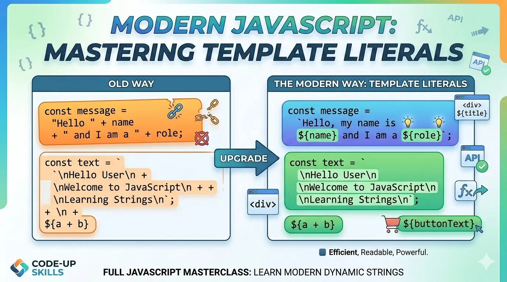
    

  </a>

 

### 25. [Array Flatten in JavaScript](https://devrahulll.hashnode.dev/array-flatten-in-javascript)

  <a href="https://devrahulll.hashnode.dev/array-flatten-in-javascript">
      

      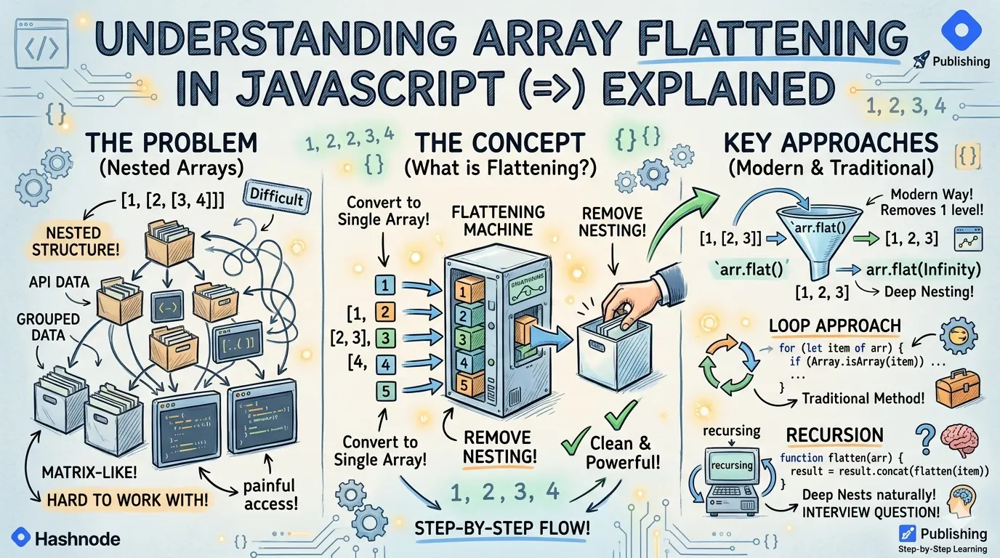
    

  </a>

 

### 26. [Callback in JavaScript](https://devrahulll.hashnode.dev/callbacks-in-javascript-why-they-exist)

  <a href="https://devrahulll.hashnode.dev/callbacks-in-javascript-why-they-exist">
      

      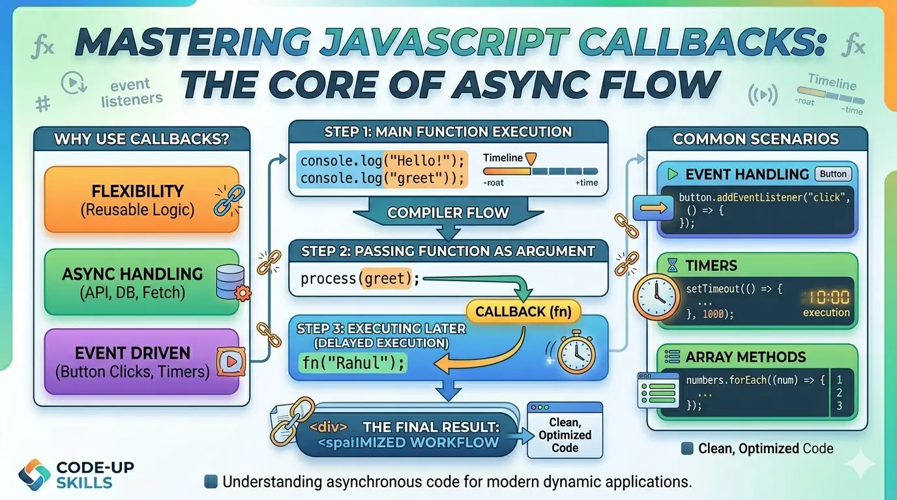
    

  </a>

 

### 27. [Understanding the `this` Keyword in JavaScript](https://devrahulll.hashnode.dev/understanding-the-this-keyword-in-javascript)

  <a href="https://devrahulll.hashnode.dev/understanding-the-this-keyword-in-javascript">
      

      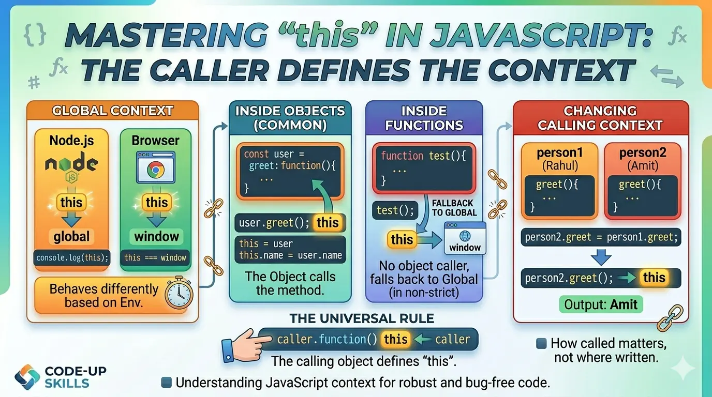
    

  </a>

 

### 28. [Spread vs Rest Operator in JavaScript](https://devrahulll.hashnode.dev/spread-vs-rest-operators-in-javascript)

  <a href="https://devrahulll.hashnode.dev/spread-vs-rest-operators-in-javascript">
      

      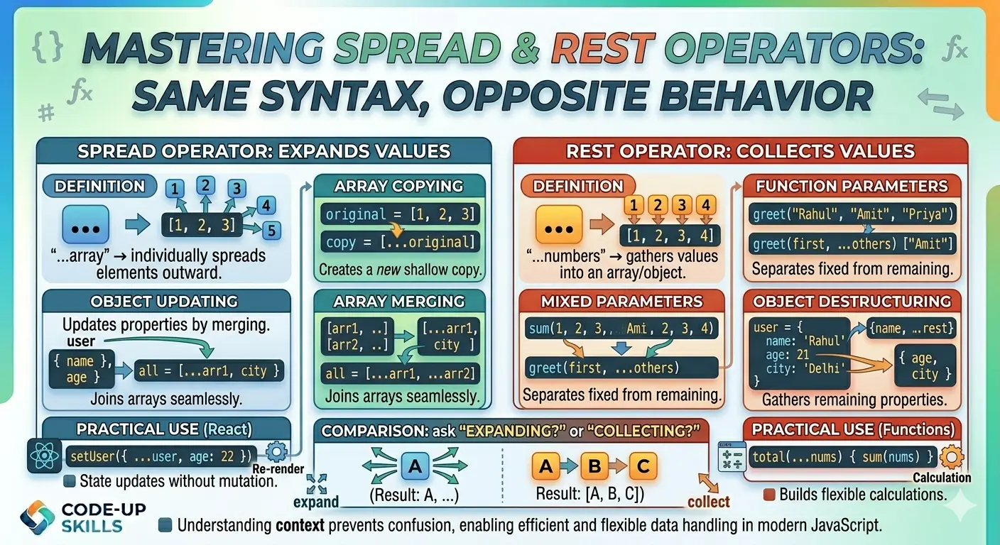
    

  </a>

 

### 29. [Destructuring in JavaScript](https://devrahulll.hashnode.dev/destructuring-in-javascript)

  <a href="https://devrahulll.hashnode.dev/destructuring-in-javascript">
      

      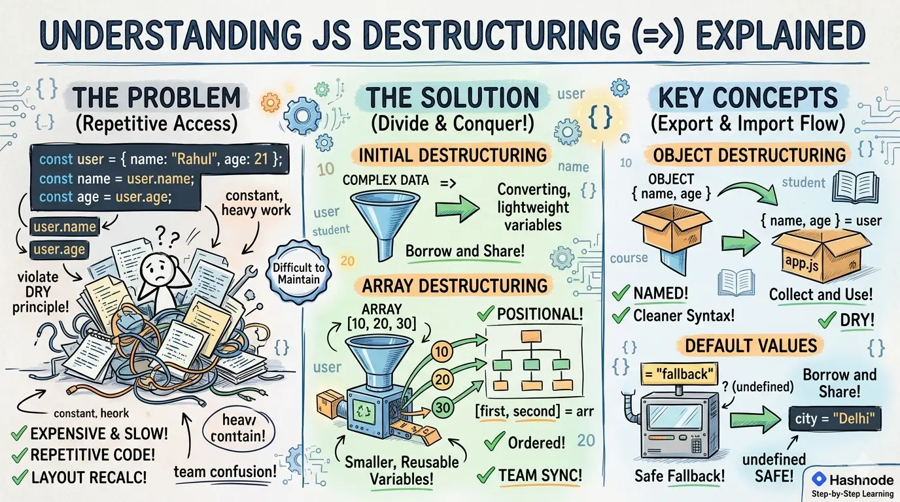
    

  </a>

 

### 30. [Error Handling in JavaScript: Try, Catch, Finally](https://devrahulll.hashnode.dev/error-handling-in-javascript-try-catch-finally)

  <a href="https://devrahulll.hashnode.dev/error-handling-in-javascript-try-catch-finally">
      

      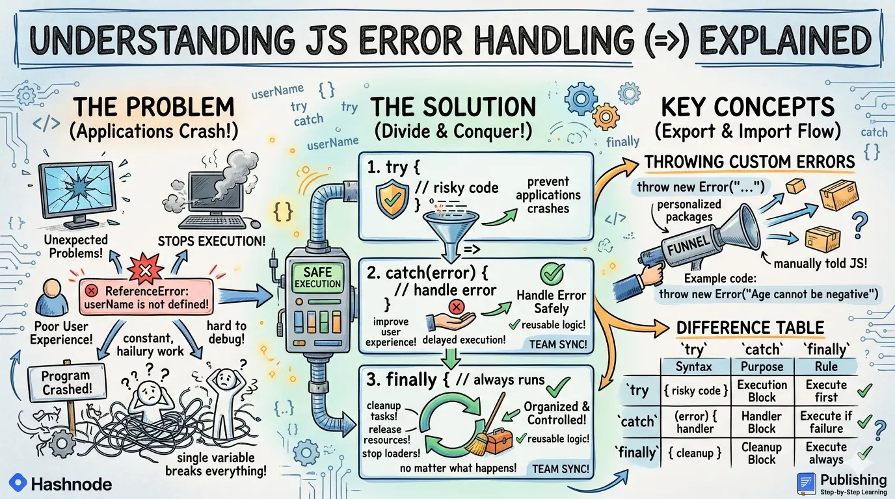
    

  </a>

 

### 31. [The new Keyword in JavaScript](https://devrahulll.hashnode.dev/the-new-keyword-in-javascript)

  <a href="https://devrahulll.hashnode.dev/the-new-keyword-in-javascript">
      

      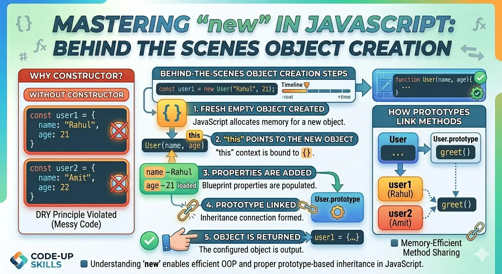
    

  </a>

 

### 32. [JavaScript Modules: Import and Export Explained](https://devrahulll.hashnode.dev/javascript-modules-import-and-export-explained)

  <a href="https://devrahulll.hashnode.dev/javascript-modules-import-and-export-explained">
      

      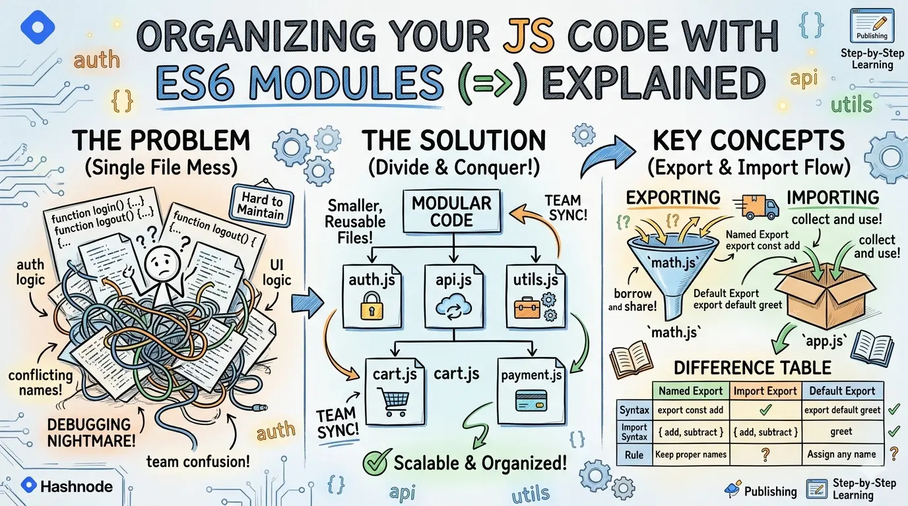
    

  </a>

 

### 33. [Synchronous vs Asynchronous in JavaScript](https://devrahulll.hashnode.dev/synchronous-vs-asynchronous-javascript)

  <a href="https://devrahulll.hashnode.dev/synchronous-vs-asynchronous-javascript">
      

      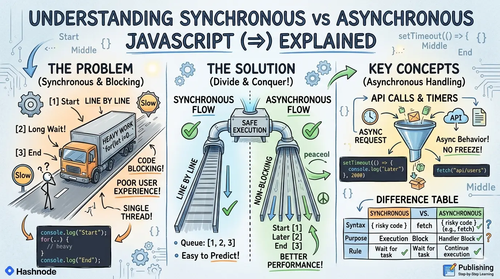
    

  </a>

 

### 34. [JavaScript Promises](https://devrahulll.hashnode.dev/javascript-promises-explained-for-beginners)

  <a href="https://devrahulll.hashnode.dev/javascript-promises-explained-for-beginners">
      

      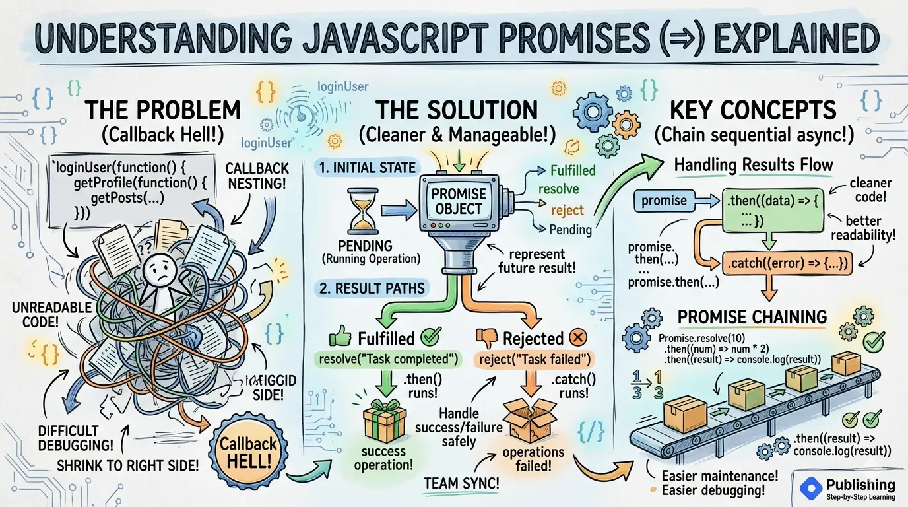
    

  </a>

 

### 35. [Map and Set in JavaScript](https://devrahulll.hashnode.dev/map-and-set-in-javascript)

  <a href="https://devrahulll.hashnode.dev/map-and-set-in-javascript">
      

      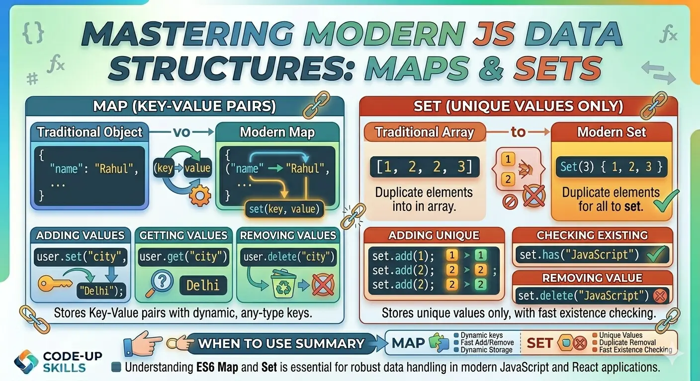
    

  </a>

 

### 36. [Linux File](https://devrahulll.hashnode.dev/linux-file)

  <a href="https://devrahulll.hashnode.dev/linux-file">
      

      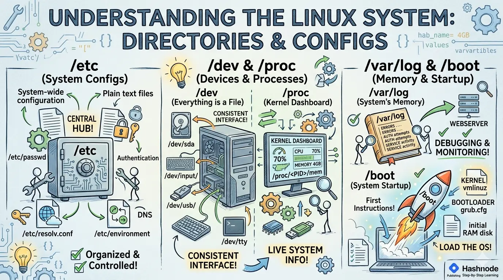
    

  </a>

 

### 37. [Async/Await in JavaScript](https://devrahulll.hashnode.dev/async-await-in-javascript-writing-cleaner-asynchronous-code)

  <a href="https://devrahulll.hashnode.dev/async-await-in-javascript-writing-cleaner-asynchronous-code">
      

      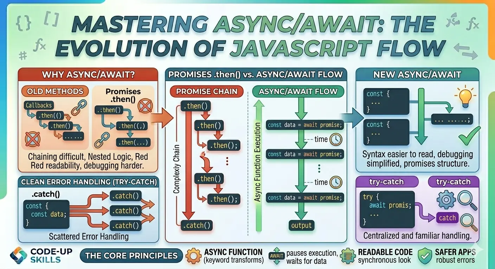
    

  </a>

 

### 38. [What is Node.js](https://devrahulll.hashnode.dev/what-is-node-js-javascript-on-the-server-explained)

  <a href="https://devrahulll.hashnode.dev/what-is-node-js-javascript-on-the-server-explained">
      

      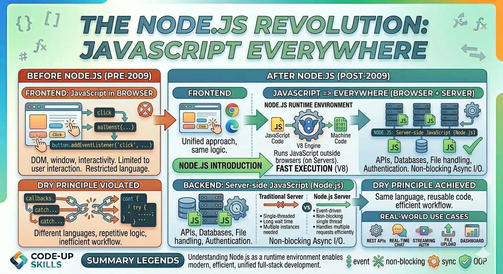
    

  </a>

 

### 39. [Why Node.js is Perfect for Building Fast Web Applications](https://devrahulll.hashnode.dev/why-node-js-is-perfect-for-building-fast-web-applications)

  <a href="https://devrahulll.hashnode.dev/why-node-js-is-perfect-for-building-fast-web-applications">
      

      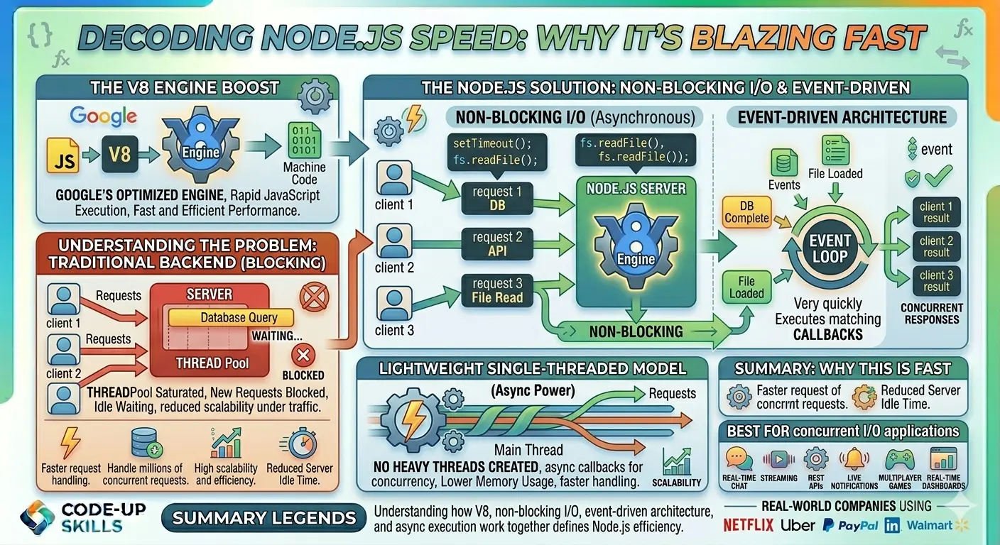
    

  </a>

 

### 40. [Setting Up Your First Node.js Application Step-by-Step](https://devrahulll.hashnode.dev/why-node-js-is-perfect-for-building-fast-web-applications)

  <a href="https://devrahulll.hashnode.dev/why-node-js-is-perfect-for-building-fast-web-applications">
      

      
    

  </a>

 

### 41. [Blocking vs Non-Blocking Code in Node.js](https://devrahulll.hashnode.dev/blocking-vs-non-blocking-code-in-node-js)

  <a href="https://devrahulll.hashnode.dev/blocking-vs-non-blocking-code-in-node-js">
      

      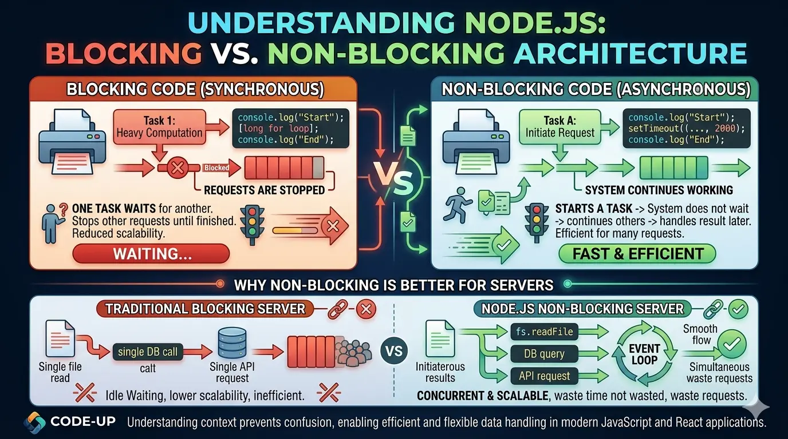
    

  </a>

 

<!-- ### 30. 

  <a href="">
      

      
    

  </a>

  -->
